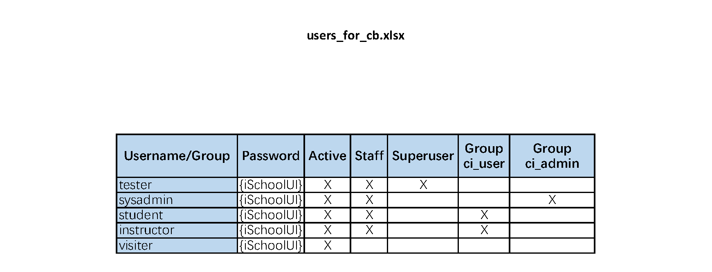
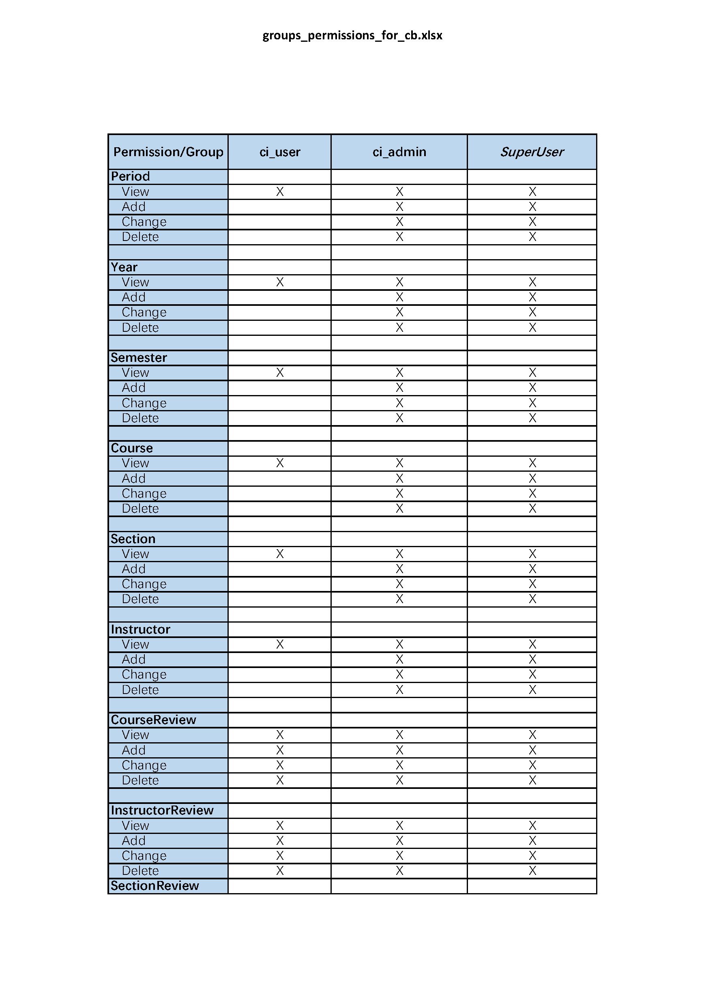
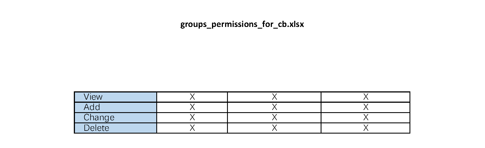

# Documentation

## Special Virtual Environment

See requirements.txt

## Application Description

Course Bench is a comprehensive platform designed to enhance the learning experience for students and instructors. Our mission is to provide a user-friendly, efficient, and engaging environment for both students and instructors to find, review, and manage courses. With Course Bench, students can access a vast array of courses offered by various institutions, along with detailed information about each course, such as course descriptions, prerequisites, and instructor profiles. Our platform allows students to search for courses based on their interests, academic goals, or specific course criteria. Furthermore, students can read and write reviews for instructors , courses and sections , helping them make informed decisions when choosing courses. Instructors benefit from Course Bench as well. In addition, Course Bench allows instructors to receive valuable feedback from students, which can help them improve their teaching methods and course materials.

## Authentication and Authorization Scheme

The application uses Django's built-in authentication system. There are two main user groups: regular users (ci_user) and administrative users (ci_admin). The following table shows the permissions assigned to each group:







## User IDs and Passwords

As shown in users_for_cb.png.

- Django superuser (tester): password {iSchoolUI}
- Regular user (student): password {iSchoolUI}
- Regular user (teacher): password {iSchoolUI}
- Administrative user (sysadmin): password {iSchoolUI}

## Testing Instructions

1. Ensure the virtual environment is set up and activated, and all dependencies are installed.
2. Run the Django application:

```
python manage.py runserver
```

1. Open a web browser and navigate to the application at http://127.0.0.1:8000/
2. Test the application using the provided user IDs and passwords.
   - Log in as a regular user or administrative user.
   - You can view/add/change/delete a instructor/course/semester/section when you login as sysadmin.
   - You can select filter to change the sort way of the list, by score or by name. It will help user find the best course/section/ instructor.
   - You can use the search box to search the result you want.
   - You can click the like or dislike button to vote for your course/section/instructor.
   - You can add comment in each detail view.
   - You can use the pie graph to better understand the course/section/instructor. 

## Other Relevant Information

1. The Home page will welcome the user with his/her name .
2. In the list view, you can see the score of the course/section/instructor, it is more user friendly.